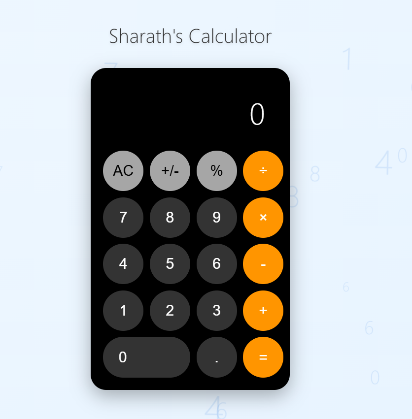

# 🧮 Sharath's Calculator

A simple and stylish calculator built using **HTML, CSS, and JavaScript**.  
It performs basic arithmetic operations with a clean and modern UI.

---

## 🚀 Features

- ➕ Perform basic arithmetic operations: **Add, Subtract, Multiply, Divide**  
- 🔄 **Toggle positive/negative (`+/-`)**  
- 🎯 **Percentage calculation (`%`)**  
- 🧹 **AC (All Clear) function** to reset the calculator  
- 🎨 **Responsive & modern UI** inspired by mobile calculators  

---

## 🛠️ Tech Stack

- ✅ **HTML5** – Structure of the calculator  
- ✅ **CSS3** – Stylish and responsive design  
- ✅ **JavaScript (Vanilla)** – Handles all calculations and interactions  

---
